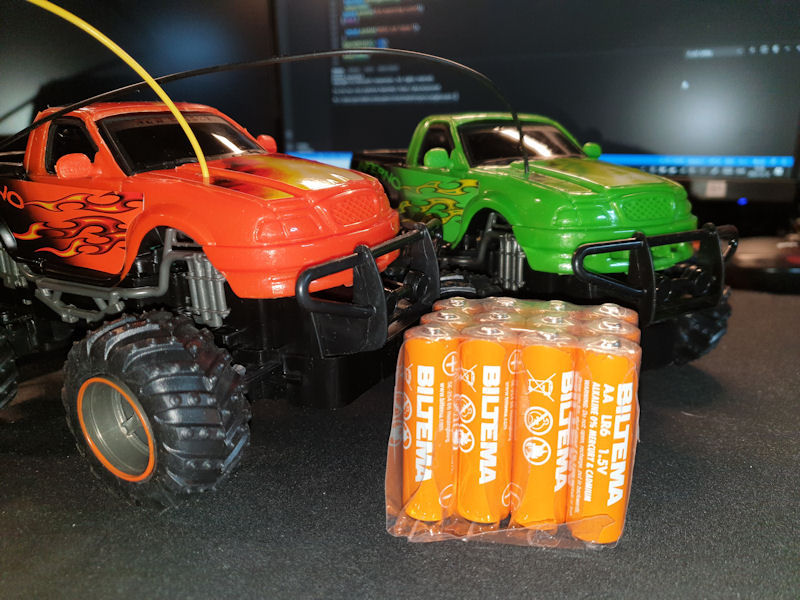
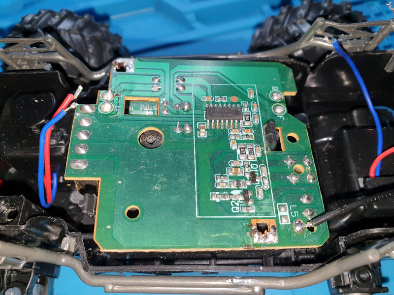
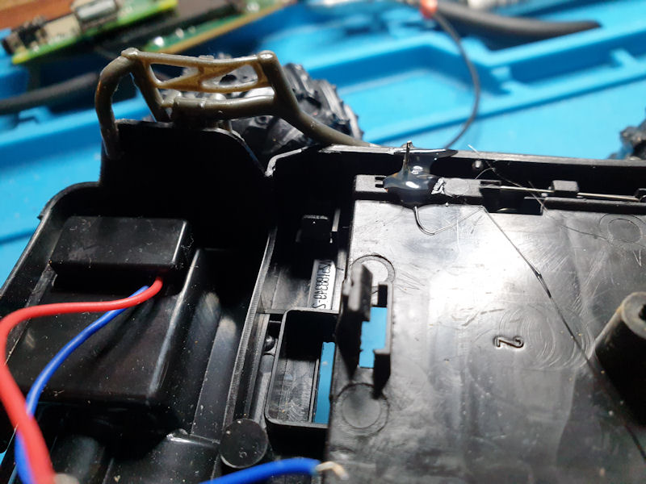
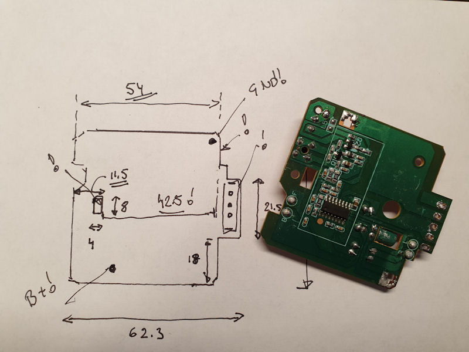
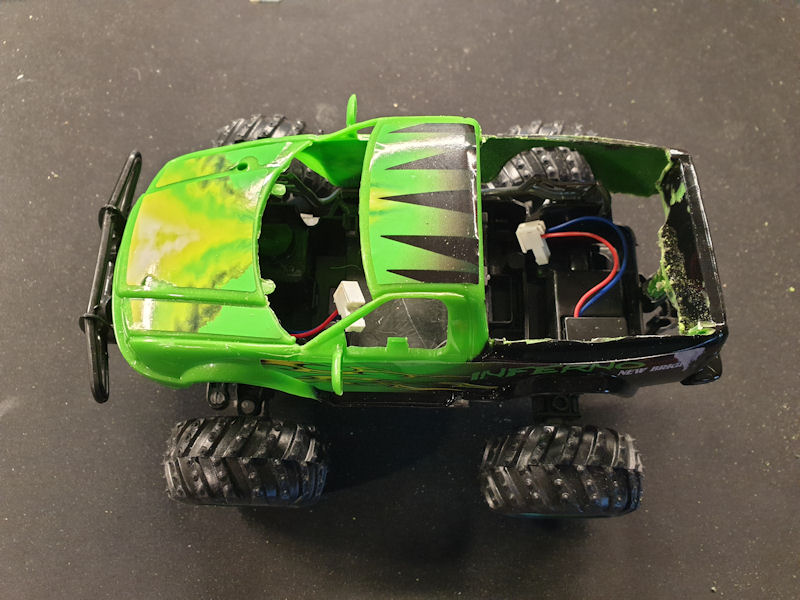
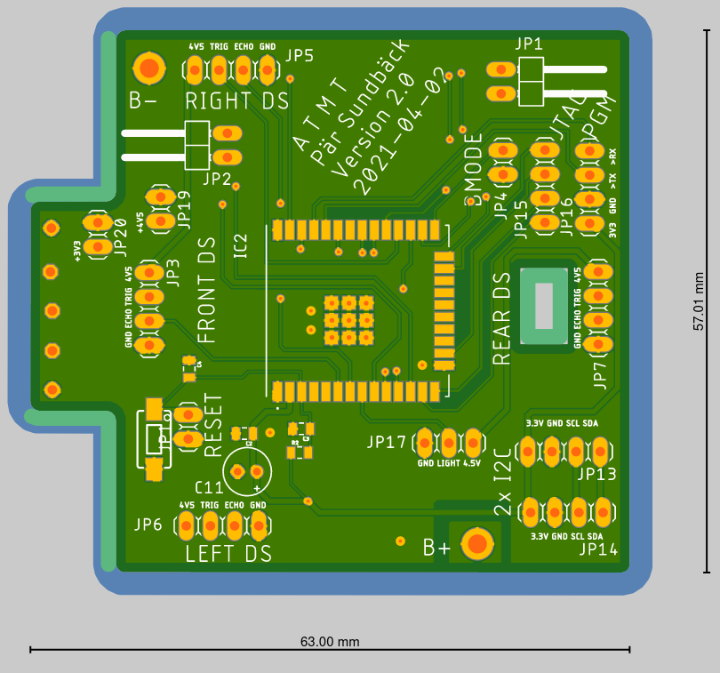
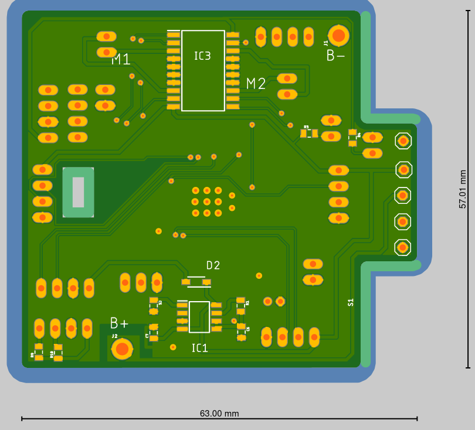
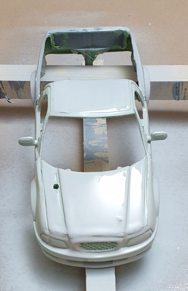
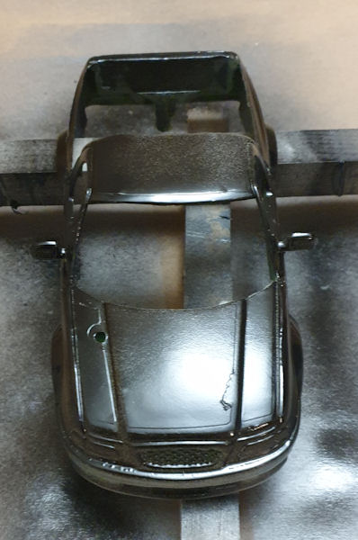

= A Toy Autonomous Monster Truck, work description

This is the working description for the hardware. When this is done we have a nice platform to use for the software development.

== Starting material
I started with a cheap radio-controlled 'monster-truck' -toy in scale 1:24. I bought mine at Biltema for about 200 SEK (20€). I actually bought two of them because these models probably changes pretty fast and it´s good idea to have a spare, for several reasons...
https://www.biltema.se/fritid/leksaker/radiostyrda-leksaker/rc-turbo-dragon-truck-124-24-ghz-2000040669

Before starting to rip it apart its also a good idea to try it out as it is, to see that the motor and steering works as expected.

== Rip it apart!
Now the fun starts!

Remove the body from the chassis. In my case there where two screws and some 'snap-ins'.

Before taking the electronics apart I measured the signals for the motor and steering. In my case these where really simple. Battery-power and reversed for backwards.

Next step was to get into the electronics. I quickly decided to keep the battery compartment and the on/off switch and then design my own PCB with the same form-factor as the original.

Next step was to de-solder the cables for the motor and steering and also the battery connection from the original PCB.

When I had removed the PCB I enforced the battery connections from the battery compartment with some glue.

When the original PCB was removed I made a sketch and took measurements for the form-factor. Since the PCB was mounted with 'snap-ins' it was important to get these measurements correct. The connections to the battery-compartment and the on/off switch also needs to be correct.

Ok, now it's time to cut out the not used part of the body and chassis to make room for the new electronics. A Dremel comes into use but be careful not to cut too much.

Now the body and chassis are prepared! The connectors on the picture are MTA-100 2 pole and these are good for using as a side connector to a PCB together with 90 degree header-pins.

== Circuit design
This is a long process... First I had some ideas what to do and then I tried to test it as much as possible, before starting with the schematics.

=== Power supply
I decided to use the 3 AA batteries from the original design for simplicity, at least in the first version. I  need a 3.3 low dropout voltage regulator and decided on a LP2989, cheap simple and in an SMD package and it can handle the 500mA that the ESP32 needs. The power to the motors will be taken directly from the batteries. Also the power-switch will be reused.

=== Motor control
I will use a SMD L293D circuit for this. This has support for 2 motors with is exactly what I need.

=== Distance sensors
I'll use 4 * HC-SR04. These are 5V sensors but work with 4.5 directly from the battery and also with the logic levels of the ESP32.

image::images/hc-sr04.jpg["Distance sensor"]

=== Other sensors
I'll include a pair of I2C connectors to use with accelerometer and electronic compass or some other I2C sensor.

=== Light
There would be cool with some lights and I'll include a couple of IO connections for that.

=== Schematics
The circutry is shown in mt-schema-v1.pdf

=== PCB
As mentioned above I used the same form-factor and measurements as the original PCB to have a good fit in the chassis. The first version of the PCB is two-sided has the MCU on the top side and the power-supply and the motor-control on the back-side. I am using SMD parts as much as possible to reduce the size. The version 1 of the PCB (shown on the pictures below)had some issues and there is now a version 2 in the /hw/pcb folder.

The PCB is a shared design at aisler.net: https://aisler.net/p/JDIHIDIT

There are connectors for the motors, the distance-sensors, 2x I2C, programming interface, boot-mode and JTAG

== Car body
Again, Biltema is a good supplier. I wanted my monster truck to be painted in black and with some yellow and red 'flames'.

To do this I needed a good primer, some paint and a coating. All as spray paint.  All this spray-paint was bought at Biltema, around 70 SEK or 7€ per 'bottle'.

Pictures shows the primer and the first layer of black paint. I can see that some polishing is needed before the next layer of paint.

 

== Software
Software for the actual control system is described else-where in this project..