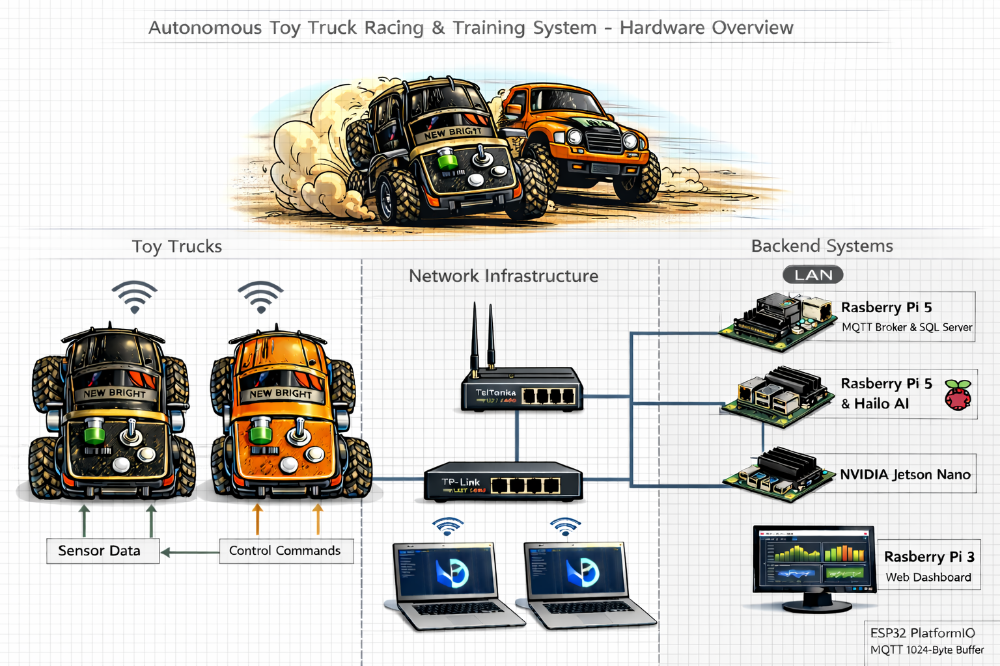
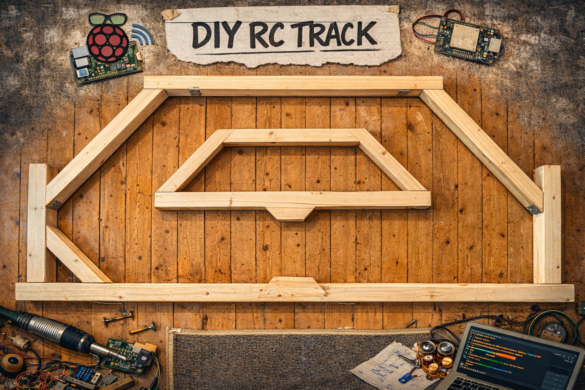
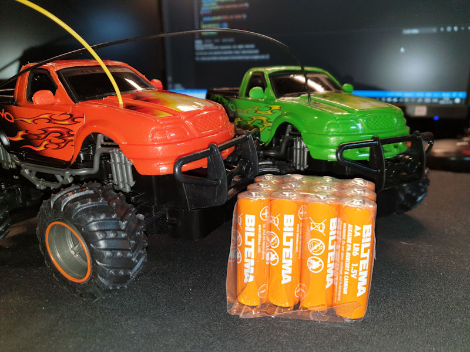

# An Autonomous Toy Monster Truck

This project is undergoing a huge change and will be updated with new information and code. The project is now being prepared for ScaniaHack 2026 and use the progress we made in 2024 and 2025 as a starting point.

The old branches are still available and can be used for reference but the scaniahack2026 branch will be uppdated and restructured and then merged back to main when the hack is over.

## The Main Project Overview
The goal here was to make an 'autonomous' toy-monster-truck, using my own electronic design and software for the control system. To get a head-start I used a cheap radio-controlled toy-truck as a start and replaced the radio-control-pcb with my own designed control-system-pcb.

The 'brain' of the truck is an ESP32-wroom 8MB and the sensors used are ultrasonic distance-sensors and acc/gyro/compass. This design was made to be simple and easy to both understand and replicate. I hope it will be a source of inspiration and give ideas for improvements. 

I now have 2 of these trucks and I am planning to use them for ScaniaHack 2026.

## ScaniaHack 2026 goal (only software)
Use the 2 working toy-trucks from last ScaniaHack to build a cooperative, learning-based autonomous 'racing' system. The trucks will explore, map, optimize speed, and avoid obstacles on a simple bounded track.

By using the data collected from the trucks, we will implement a learning-based algorithm to optimize the racing strategy. The trucks will communicate with a backend server to share information about the track and their performance. The backend server will also be responsible for storing the data and providing insights into the performance of the trucks.

Link to the complete project description for ScaniaHack 2026: [ScaniaHack 2026 project description](doc/ESP32_Truck_Hackathon_Project_Description.pdf)

### The simple track
Built with 45x70mm wood-planks, the track is a closed loop with angled corners and a clear start/finish line (the narrowest part).

### What we have
* 2 working toy-trucks with the same hardware setup and 'ota' capabilities
* A backend server for data collection, analysis and training of the learning-based algorithm
* A simple track for testing and racing
* Software components for sensors, basic control, data collection, and communication with the backend server
* A server showing a dashboard with the telemetry

### What we need to implement
* An updated control-loop that 'explores' the track
* A backend 'training' that use the telemetry data to figure out the track geometry
* An updated control-loop that uses the inf from backend to 'race' the track

## How to contribute (not only code or ScaniaHack 2026) 

(More details for the git-magic in the wiki)

* Fork this repo from main and do your thing in a feature-branch from this fork on your own github-account 
* When done, make a pull-request back to main and describe your changes in the pull-request
* Try to keep one feature or bug-fix per pull-request to make the merging easier
* If you have any questions or need help, just ask me by pm, email, IRL or in the pull-request and I will try to help you out.

**Note: when working in vscode with platformio you need to open the EmbeddedSw subfolder from where you have cloned the repo, and then you can work, build and download to esp from there.**

## How to get started

[How to get started with coding](getstarted.md)

[HW schematics for reference](toy-truck/electronics/atmt-schematic-v3.pdf)

[Used hardware](toy-truck/electronics/hardware.md)

## Documentation

* [Arduino OTA Process Guide](arduino-ota-process.md) - Complete guide for wireless firmware updates
* [Kalman Filter Implementation](kalman_filter.md) - Sensor fusion and filtering algorithms
* [EmbeddedSw Documentation](EmbeddedSw/README.md) - Main firmware documentation
* [Dashboard Setup](truck_telemetry_dashboard/README.md) - Real-time telemetry dashboard
* [Remote Control Guide](remote/README.md) - Manual and AI-based remote control

## Repo layout:

All sections are undergoing change and will be updated with new information and code. 

* doc: documentation and images, 
  * A workdescription for the conversion
  * A proposal for how to setup the work at ScaniaHack
* hw: electronics hardware including:
  * PCB layout and all the schematics in KiCAD format. 
  * References to used components etc. 
* toy-truck
  * CAD models and 3d printables for some add-ons to the toy-truck chassi.
* EmbeddedSw: this is the 'real' software and the VsCode project you should open in order to work with the code. To test different parts of the software we use 'environments' in the platformio.ini file.
* arduino-ota-process.md: Complete guide for Over-The-Air firmware updates
* kalman_filter.md: Implementation guide for sensor fusion algorithms
* truck_telemetry_dashboard: Real-time web dashboard for monitoring truck data
* remote: Remote control scripts and computer vision detection
* hw-test-sw: software for testing the hardware, like hello world.
* www: software for the backend web-server, like
  * post log script
  * view log script

## Other uses:
It is possible to use my PCB-design for an other type of vehicle or use the schematics and build any other sort of control-board. The ESP32 is a very versatile microcontroller and can be used for many different applications.

## Good links to get started with ESP32

* [Random Nerd Tutorials](https://randomnerdtutorials.com)
* [Espressif Resources](https://www.espressif.com/en/products/socs/esp32/resources)
* [ESP-IDF Programming Guide](https://docs.espressif.com/projects/esp-idf/en/latest/esp32/get-started/index.html)
* [Arduino Guide for ESP32](https://www.arduino.cc/en/Guide/ESP32)

## Connect and download to the ESP32

Connecting and downloading to the ESP might be a nightmare some times. Usually it goes well but when it starts to bug it can go on forever. However, you are not alone, google will help out when you search for your error message. 

Sometimes it works better if you power the pcb from the usb-port using a 3.3V type of FTD like FTDI1232 set to 3.3V. In this case the power from the batteries needs to be off or you might destroy the circuit. **Always leave battery-power off when using power from the programming interface**.

## Errata HW version 3 (important stuff)

* Some connections where missing in the first version of the schematics, like the connection between the B+ and the diode in the voltage-regulator. This is now fixed in the schematics and the pcb-layout for version 3.1

## Errata HW version 2 (important stuff)

* To keep the ESP safe on the io-side I am using rechargable batteries summing up to 3.6 volts which works just fine, but with alkalines you will probably get like 4.6 or 4.7 volts with fresh batteries which might damage the ESP32 io. Don't use those... 
* In the schematics I used a 1N4148 diode for reversed polarity protection but this was NOT a good choice. This can be left out completely or replaced by a schottky type of diode with a low voltage-drop.

## Starting material from Biltema's toy-department

Unfurthunatly this specific model is not sold anymore at Biltema but there are many other models at Biltema or elsewhere that can be used for this project. The most important thing is that the chassi is big enough to fit the new electronics and that the wheels are big enough to handle the terrain you want to drive on.

## Designing a new PCB formfactor

You can of course also design a new PCB formfactor from the schematics provided. The KiCAD files in the `hw` directory include all the necessary components and connections. Feel free to modify the layout to better fit your specific needs or to improve the design. If you come up with a better design, please share it with the community by making a pull-request.

[Schematics for reference](hw/atmt-schematic-v3.pdf)

