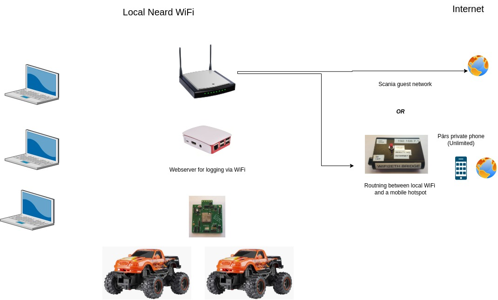

# Setup for the ScaniaHack (proposal)

## Oveview and workflow

At the hack, preferably use a private laptop since you are the admin for it,  and it doesn't have limitations for used networks, firewall-settings and softwares. 

## Network:

A private wifi where we connect developer machines, cars and webserver. We can also OTA the cars directly from VsCode (hopefully). See ota link below.

The netwok must be connected to internet, either via a networkcable to Scanias guest-network or via a mobile hotspot and an extra 'router'.

## Webserver

A 'LAMP server' with a database to store and sort loggs from the cars while driving and some area for a common storage.

https://randomnerdtutorials.com/raspberry-pi-apache-mysql-php-lamp-server/

## OTA:

https://randomnerdtutorials.com/esp32-ota-over-the-air-vs-code/

## (Some) areas of work
* Architecture
* Driver-control
* Sensor sw components
* Server used for logging
* git DD

