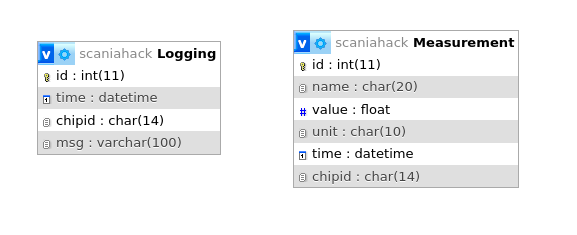

# Backend files

The server is located at 192.168.2.2 in the local HackNet1.

Instructions for mounting fileshares in linux at http://192.168.2.2/

## The database tables
#

## post_log.php
Inserts data to the logging table

http://192.168.2.2/post_log.php?chipid=123&msg=LogMessage

## post_value.php
Inserts data to the Measurment table

http://192.168.2.2/post_value.php?chipid=123&name=distr&value=32.5&unit=cm

## scaniahack-db-exp.sql

A dump of the databse structure and some content in the logging table.

## TBD
Add scripts for filtering and viewing of logs and measurements
